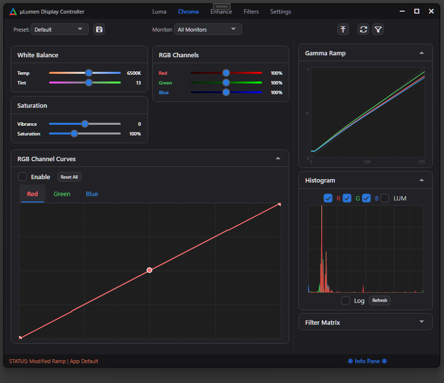

<!-- markdownlint-disable MD041 -->
<h1 align="center">μLumen</h1>

<p align="center">
  
</p>

<p align="center">
  Display Control & Calibration for Windows<br>
  <strong>Free&nbsp;•&nbsp;Open&nbsp;Source&nbsp;•&nbsp;MIT Licensed</strong>
</p>


<p align="center">
  
</p>

---

μLumen is a lightweight Windows desktop application for real-time monitor color calibration and display color manipulation. Inspired in part by the range of control afforded by image manipulation software (GIMP, Photoshop, etc), μLumen provides professional-grade controls. Gamma ramps, tone curves, color temperature, ICC profile management, and fullscreen color matrix filters... all through a clean, custom-themed dark UI with zero external dependencies (beyond NET 8 and Windows SDK).

---

## ✨ Features

<details open>
<summary>Gamma Ramp Engine (per-channel, per-monitor)</summary>

- Brightness, contrast, gamma, exposure, and offset
- Five-zone tonal control: blacks, shadows, midtones, highlights, whites. 
  - Q-factors are adjustable in code-behind, not user facing.
- Color temperature (2000K–10000K) with tint (green/magenta axis)
- Independent R/G/B channel gains
- Saturation and vibrance (selective saturation that protects already-saturated colors)
- Levels control (input/output black and white point remapping)
- Master and per-channel tone curves with interactive click-and-drag editing
- Dynamic contrast (S-curve enhancement), blue light filter, black equalizer, white equalizer
- Monotone cubic Hermite spline interpolation for smooth, overshoot-free curves
</details>

<details open>
<summary>Fullscreen Color Matrix Filters (Magnification API)</summary>

- Operates at the DWM composition level, independent of gamma ramps
- 5×5 color transformation matrix with composable operations
- Built-in presets: Grayscale, Inverted, Sepia, Night Light, Warm Film, Cool Film, Cyberpunk, Noir, Vintage, HDR Effect, High Contrast
- Color vision deficiency corrections: Protanopia, Deuteranopia, Tritanopia
- Per-channel gain, offset, hue rotation, vibrance, exposure, black/white point, split toning
- Adjustable preset strength (blend between identity and preset)
- Live 5×5 matrix preview in the UI
</details>

<details>
<summary>Multi-Monitor Support</summary>

- Per-monitor or all-monitors targeting
- Independent gamma ramp state tracking per display device
- Original ramp capture on startup for clean resets</details>

<details>
<summary>Dual Display Backend</summary>

- **GDI** (`SetDeviceGammaRamp`): Legacy path, technically deprecated by MS but still useful, universal compatibility, 256 control points. Can conflict with other software packages.
- **DXGI** (`IDXGIOutput::SetGammaControl`): Modern path, 1025 control points, Catmull-Rom cubic upsampling from GDI ramps, hardware-accelerated through the graphics driver. The DXGI code is implemented but not usable without forcing full screen or similar view modes.

</details>

<details>
<summary>System Integration</summary>

- Native Win32 system tray icon (no WinForms dependency)
- Global hotkeys for brightness, contrast, gamma, and color temperature (work without focus)
- Start minimized to tray, minimize-on-close, always-on-top
- Optional reset-to-system-defaults on exit
- Persistent user presets (JSON, saved to `%LocalAppData%\DisplayControl\Presets`)
- Settings persistence (JSON, saved to `%LocalAppData%\DisplayControl\settings.json`)</details>

<details>
<summary>Custom WPF Dark Theme</summary>

- Full suite of restyled controls: buttons, checkboxes, combo boxes, radio buttons, sliders, tab controls, progress bars, group boxes, text boxes, list boxes, tree views, list views, context menus, expanders, scrollbars
- Gradient slider variants and custom range slider control
- DWM integration: immersive dark mode, Mica backdrop, transparent border, rounded corners
- Custom non-client area handling (`WM_NCHITTEST`, `WM_NCACTIVATE`, `WM_NCCALCSIZE`) for chromeless resizable window
- Color palette: `#1E1E22`–`#2B2B30` backgrounds, `#2A7AE2` accent blue, Segoe UI typography</details>

<details>
<summary>Visualization</summary>

- Real-time RGB gamma ramp curve display (custom `OnRender`/`DrawingContext` control)
- Screen histogram via native GDI screen capture with configurable downsampling
- Optional real-time histogram updates as adjustments are made</details>

<details>
<summary>ICC Profile Management</summary>

- Enumerate all system ICC/ICM profiles from `%SystemRoot%\System32\spool\drivers\color`
- Associate and set default ICC profiles per monitor via WCS API
- Quick-launch buttons for Windows Color Management, Display Settings, and the profile directory</details>

---


## 📋 Requirements

- **OS**: Windows 10 or later (Windows 11 recommended for Mica backdrop)
- **Runtime**: .NET 8.0 (Windows Desktop)
- **Hardware**: Any GPU with standard gamma ramp support; DXGI backend requires DirectX 10+ capable adapter

---

## ⬇️ Download

### Latest Release: v0.0.1

**[μLumen v0.0.1 for Windows](./download/uLumen0.0.1.zip)** (x64)

**[DIRECT DOWNLOAD v0.0.1 - x64](https://github.com/stephenmthomas/lumen/blob/master/download/uLumen0.0.1.zip)**


**Installation:**
1. Extract the ZIP file
2. Run `DisplayControl.exe`
3. No installation required

---

## 🛠️ Building from Source

```bash
git clone https://github.com/stephenmthomas/lumen.git
cd uLumen
dotnet build -c Release
```

The output will be in `bin/Release/net8.0-windows/`. 

No NuGet packages or external dependencies are required - all display manipulation uses built-in Windows APIs via P/Invoke.

---

## 🚀 Quick Start

1. Run `DisplayControl.exe`
2. The settings window opens centered on screen; the tray icon appears in the system tray
3. Select a monitor from the toolbar dropdown (or leave on "All Monitors")
4. Adjust sliders - changes apply in real-time if "Real-Time Updates" is enabled
5. Use the built-in presets (Default, Night, Reading, Gaming) or save your own
6. Right-click the tray icon for quick preset access and reset


<h3 align="center">Global Hotkeys</h3>
<p align="center">

| Shortcut | Action |
|---|---|
| `Ctrl+Alt+Up/Down` | Brightness ±5 |
| `Ctrl+Alt+Left/Right` | Contrast ±5 |
| `Ctrl+Shift+Up/Down` | Gamma ±5 |
| `Ctrl+Shift+Left/Right` | Color Temperature ±100K |
| `Ctrl+Alt+R` | Reset to defaults |


</p>

---

## 🏗️ Architecture Overview

μLumen uses a direct code-behind architecture; services are instantiated in `App.OnStartup` and passed into the `SettingsWindow` constructor. There is no MVVM framework.

The two independent color manipulation paths (gamma ramps and color matrix filters) can be layered together for effects that neither system can achieve alone. Gamma ramps provide per-channel LUT control (tone curves, levels, nonlinear gamma), while the Magnification API provides true cross-channel operations (hue rotation, color-space-aware saturation, color vision corrections).

μLumen is built in the WPF framework (my first WPF attempt) and uses a full suite of control styles, a theme framework, and a fully custom form. It also features several custom control types (histogram, curve editor, etc.)

See `USER_GUIDE.md` for a complete walkthrough of every feature and the technical pipeline.

---

## 📝 License

<details>
<summary>MIT License – click to expand</summary>

```text
MIT License

Copyright (c) 2026 Stephen Thomas

Permission is hereby granted, free of charge, to any person obtaining a copy
of this software and associated documentation files (the "Software"), to deal
in the Software without restriction, including without limitation the rights
to use, copy, modify, merge, publish, distribute, sublicense, and/or sell
copies of the Software, and to permit persons to whom the Software is
furnished to do so, subject to the following conditions:

The above copyright notice and this permission notice shall be included in all
copies or substantial portions of the Software.

THE SOFTWARE IS PROVIDED "AS IS", WITHOUT WARRANTY OF ANY KIND, EXPRESS OR
IMPLIED, INCLUDING BUT NOT LIMITED TO THE WARRANTIES OF MERCHANTABILITY,
FITNESS FOR A PARTICULAR PURPOSE AND NONINFRINGEMENT. IN NO EVENT SHALL THE
AUTHORS OR COPYRIGHT HOLDERS BE LIABLE FOR ANY CLAIM, DAMAGES OR OTHER
LIABILITY, WHETHER IN AN ACTION OF CONTRACT, TORT OR OTHERWISE, ARISING FROM,
OUT OF OR IN CONNECTION WITH THE SOFTWARE OR THE USE OR OTHER DEALINGS IN THE
SOFTWARE.

```

</details>

---

## 🙌 Acknowledgments

- Color temperature algorithm based on Tanner Helland's approximation of Planckian locus CIE chromaticity
- Rec. 709 luminance coefficients for perceptual color operations
- Fritsch-Carlson monotone cubic interpolation for overshoot-free tone curves
